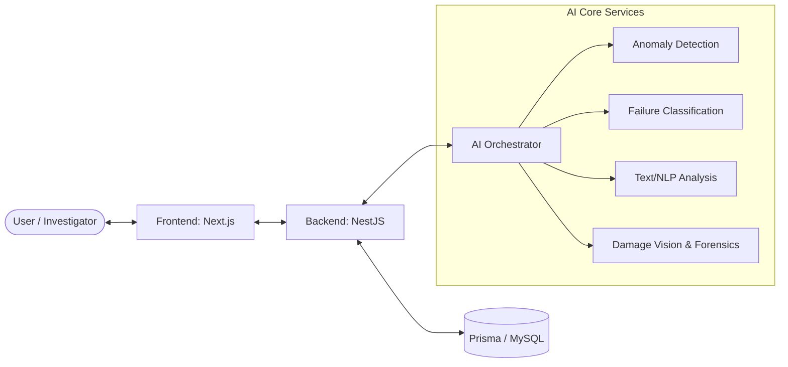

# 🛡️ Industrial Insurance Fraud Detection System

**A modern, multi-modal AI platform for detecting fraudulent industrial insurance claims.**

This project combines advanced sensor analysis, computer vision (damage detection & forensics), and natural language processing to identify suspicious patterns and prevent insurance fraud in industrial environments.

---

## 🏗️ System Architecture

The platform follows a microservices-based architecture to ensure scalability and isolation between the business logic, the user interface, and the specialized AI models.



---

## 🚀 Project Components

### 💻 Frontend ([frontend/](./frontend/README.md))
- **Stack**: Next.js, TypeScript, Tailwind CSS, Lucide Icons.
- **Port**: 3000
- **Features**: Investigator Dashboard, Claim Management, Interactive Fraud Reports.

### ⚙️ Backend ([backend/](./backend/README.md))
- **Stack**: NestJS, TypeScript, Prisma ORM, BullMQ.
- **Port**: 3001
- **Role**: Core business logic, data persistence, and AI job orchestration.

### 🧠 AI services ([ai-services/](./ai-services/README.md))
- **Stack**: Python, FastAPI, XGBoost, YOLOv8, PyTorch.
- **Ports**: 8000-8004
- **Role**: Real-time analysis and fraud scoring based on sensor data, images, and text.

---

## 🛠️ Quick Start (Docker)

To run the entire system locally using Docker Compose:

1.  **Clone the repository**:
    ```bash
    git clone https://github.com/AsmaKhetib/Industrial-Insurance-Fraud-Detection.git
    cd Industrial-Insurance-Fraud-Detection
    ```

2.  **Start all services**:
    ```bash
    docker-compose up -d
    ```

3.  **Access the applications**:
    - **Frontend**: [http://localhost:3000](http://localhost:3000)
    - **Backend API**: [http://localhost:3001/api](http://localhost:3001/api)
    - **AI Explorer (FastAPI Docs)**: [http://localhost:8000/docs](http://localhost:8000/docs)

---

## 📑 Detailed Documentation

- [AI Ecosystem Overview](./ai-services/README.md)
- [Classification Service (Model 2)](./ai-services/classification-service/README.md)
- [Vision & Damage Analysis (Model 4)](./ai-services/vision-service/README.md)

---

## 👩‍💻 Contributors & Research

- **Main Author**: [Asma KHETIB](https://github.com/AsmaKhetib) — University M'Hamed Bougara de Boumerdès (UMBB)
- **Project Type**: Multidisciplinary Graduation Project 2025/2026.
- **Supervisor**: Dr. Youcef YAHIATENE (UMBB)
