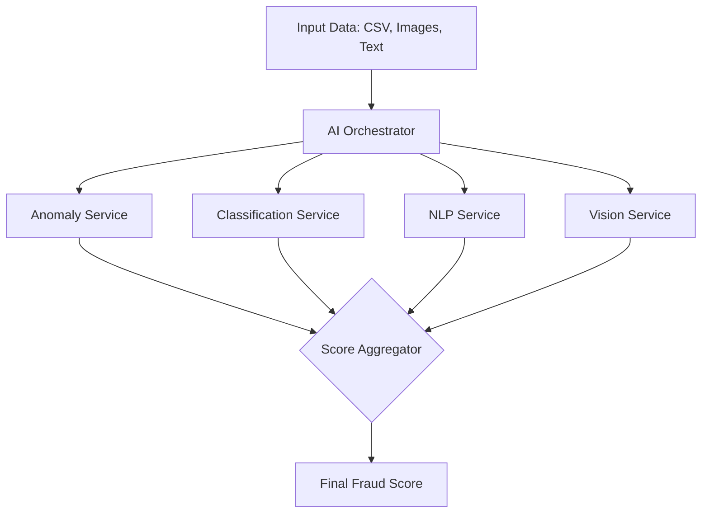

# 🧠 AI Ecosystem — Industrial Insurance Fraud Detection

Welcome to the AI core of the Industrial Insurance Fraud Detection system. This directory contains a suite of specialized microservices designed to analyze industrial sensor data, images, and text to detect fraudulent insurance claims.

---

## 🏗️ AI Pipeline Architecture

The system uses a **multi-modal approach**, combining four specialized AI models to generate a final fraud probability score.



---

## 🧪 The Specialized Models

### 1. 🔍 Anomaly Service (Port 8001)
- **Model**: Isolation Forest (Scikit-Learn).
- **Role**: Detects statistical outliers in sensor data that don't match typical machine behavior.
- **Input**: Sensor readings (Temperature, RPM, Torque, etc.).

### 2. 🤖 Classification Service (Port 8002)
- **Model**: XGBoost Classifier.
- **Role**: Categorizes pannes into 4 classes: `FAKE`, `SABOTAGE`, `REAL_FAILURE`, `NORMAL_WEAR`.
- **Details**: See [classification-service/README.md](./classification-service/README.md).

### 3. 📝 NLP Service (Port 8003)
- **Model**: Transformers (BERT-based).
- **Role**: Analyzes the textual description of the incident to find inconsistencies or suspicious patterns in the narrative.
- **Input**: Claim descriptions and reports.

### 4. 👁️ Vision Service (Port 8004)
- **Model**: YOLOv8 + ELA + EXIF Forensics.
- **Role**: Detects physical damage on machine parts and analyzes images for digital manipulation.
- **Details**: See [vision-service/README.md](./vision-service/README.md).

---

## ⚖️ Final Fraud Score Formula

The **AI Orchestrator** (Port 8000) collects scores from all services and calculates the final weighted probability:

$$Score_{final} = 0.35 \cdot S_{anomaly} + 0.25 \cdot S_{classification} + 0.20 \cdot S_{NLP} + 0.20 \cdot S_{vision}$$

- **Score > 80%**: High Fraud Risk (Automatic flag for investigation).
- **Score 40-80%**: Suspicious (Requires manual review).
- **Score < 40%**: Low Risk (Standard processing).

---

## 🚀 Getting Started

### Prerequisites
- Docker & Docker Compose
- Python 3.11 (for local development)

### Running the entire AI stack
Each service is containerized. To start the full AI ecosystem:

```bash
cd ai-services
docker-compose up -d
```

### Individual Development
Each service follows a similar pattern (FastAPI + Pydantic). Refer to the individual service directories for specific setup and training instructions.

---

## 🛠️ Global Technologies
- **Framework**: [FastAPI](https://fastapi.tiangolo.com/)
- **Server**: [Uvicorn](https://www.uvicorn.org/)
- **Machine Learning**: XGBoost, Scikit-Learn, PyTorch, Ultralytics (YOLOv8)
- **Data Science**: Pandas, NumPy
- **Orchestration**: Docker, BullMQ (Integration with NestJS)